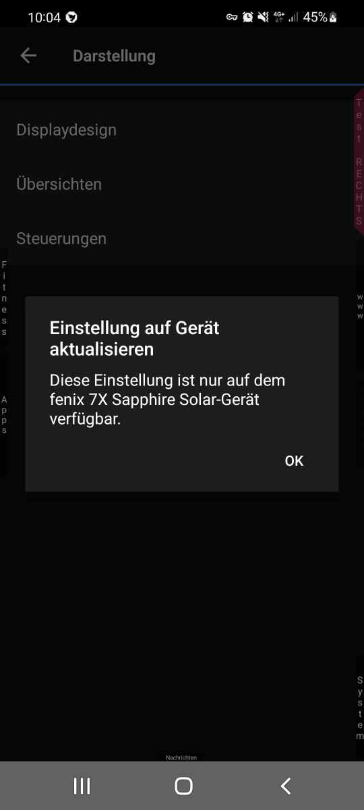
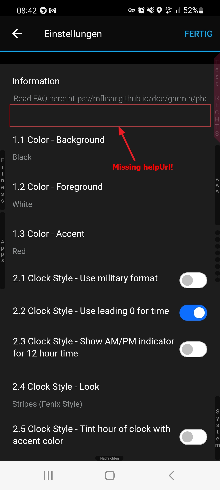
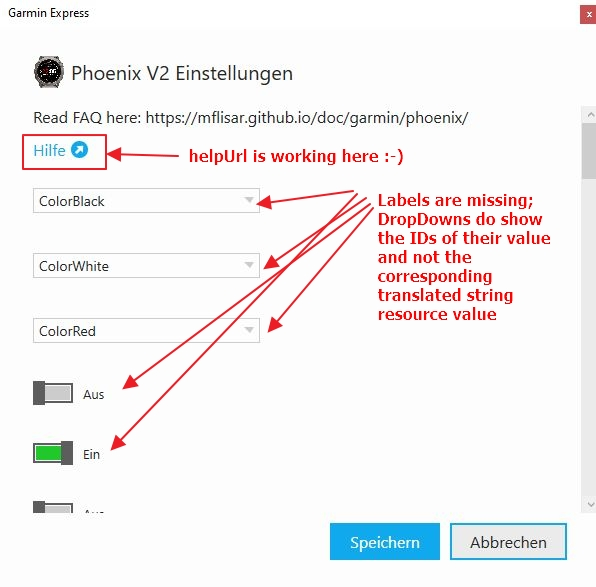

### Information

I tried to solve this issue via the garmin custom support (Product.Support@garmin.com) and in the end they told me to write my issues to the developer support (https://www.garmin.com/en-US/forms/developercontactus/) which very almost for sure isn't the correct place either and which is saying that it won't answer if the issue is not develper relevant. So as I don't know what to do now and would ask the dev guy who is processing this issue to either accept the issue here or to forward it to the correct place.

### Appeal

I do put as much effort in this report as possible to make my issues as clear and reproducable as possible so please, whoever is processing this issue don't point me to some other place and simply close this issue but please make sure that this information is forwarded to someone who can put those issue into their todo list so that the issue may be solved one day.

# BUGS

1) **Android Connect IQ app** (https://play.google.com/store/apps/details?id=com.garmin.android.apps.connectmobile)

    * **[BUG1]:** the app does not open settings of a custom watchface nor does it list the installed custom watchfaces on a Fenix 7X (it does do both with a Fenix 6X) - check out following screenshot from using this app with the Fenix 7X SS:

        

    * **[BUG2]:** inside the settings of a custom watchface, the app does not show the help urls that a watchface developer can define (check out the helpUrl field that's defined here: https://developer.garmin.com/connect-iq/core-topics/app-settings/) - this helpUrl did work in the past though and it works inside the pc - check out following screenshot from using this app with the Fenix 6X Pro:

        

2) **Windows App**

    **[BUG3]:** on a Fenix 7X the windows app does not work with settings of a custom watchface either, it does following:
    * it does not show settings translations but does show their resource identifier (which may be readable or may not)
    * the same is true for list values
    * it does not show labels for settings at all, checkboxes are e.g. checkboxes without any text anywhere...
    * check out following screenshot from using this app with the Fenix 7X SS:

        

        
